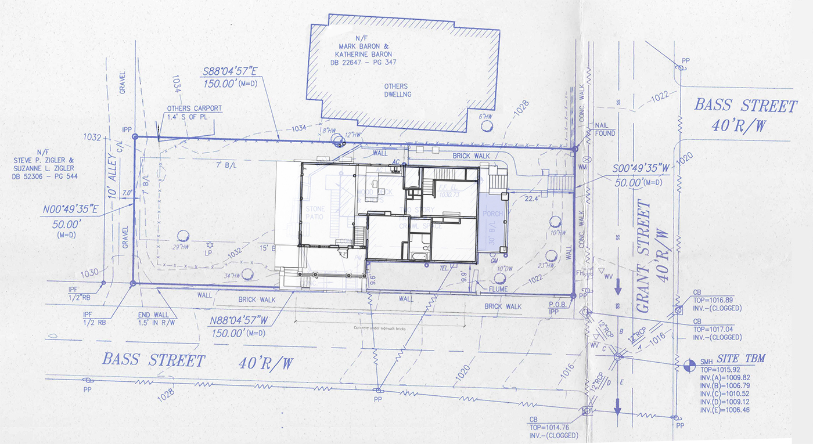
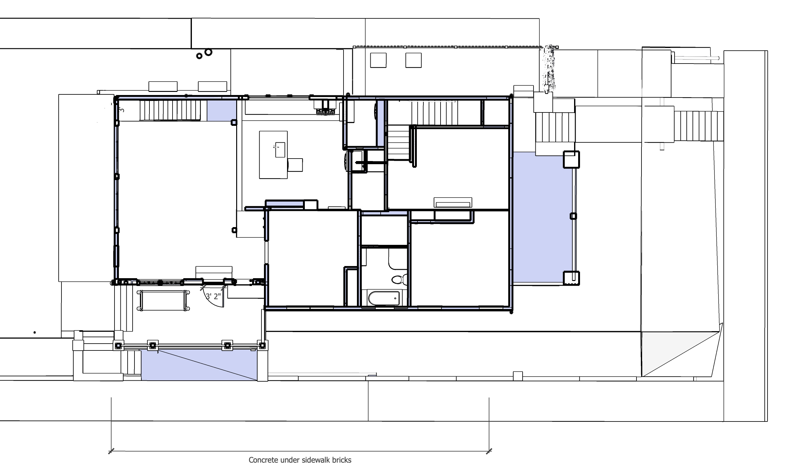

<!--
Renovation Construction Loan
Based on value of home at time of project completion

Dan uses calendly.com
$250 for site consult - for scope of work
pre-construction heavy planning

Recommended Barry Center State > Scarlett Tassone

To do: 

Floor Area Ratio (FAR) - 55%
https://www.investopedia.com/terms/f/floor-area-ratio.asp

Zero lot line variance - Add photos of neighbors on Bass
-->

<a href="sketchup/721-Grant-Street.skp">Download SketchUp Model</a>

*Phases 1-5*
- 2022 - [HVAC](side) - New HVAC, Crawlspace wall under front porch.
- 2022 - [Bumpout, Attic and Roof](side) - Expand kitchen 3.5', attic porch, paint exterior
- 2022 - [Bathroom - Downstairs](bathroom/) - New on south side
- 2022 - [Upstairs - Bathroom and Craft Room](upstairs/) - Straighten stairway, upstairs bathroom, create downstairs pantry
- 2022 - [Kitchen and Craftroom](kitchen) - Counters and cabinets in downstairs kitchen, craftroom and new pantry
- 2023 - [Ongoing Projects](projects/) - Repointing, crawlspace

*Phases 6-15*
- 2025 - [Basement](basement/) 
- 2025 - [Patio](patio/) - Mass timber over outdoor kitchen<!-- ($15,000)-->
- 2028 - [Addition](addition/) - Master bedroon, master bath, grey water<!--($150,000)-->
- 2028 - [Livingroom](livingroom/) 

## Survey and Dimensions

   

Existing house indicated in blue.  Laundry area will be removed from back.  <a href="sketchup/721-Grant-Street.skp">SketchUp Model</a>

   

### Existing:
2,438 ft² with laundry areas, which will be removed. (Dimension source: Fulton county website)    
2,355.4 ft² two floors retained (with laundry area removed, includes stairwell)  
1,177.7 ft² per floor retained (includes stairwell)  

### Addition:
639 ft² per floor (includes stairway openings. Does not include exterior walls)   
48.13 ft² per floor - North jut-out adjacent to existing kitchen.  
1374.26 ft² total new addition

Total (excluding attic and basement):  
2,355.4 + 1374.26 = 3729.66 ft²  

Allowable house 3750 ft² (from survey)  
Land Area 7,501 ft² from [clustrmaps.com](https://clustrmaps.com)<!-- source https://clustrmaps.com/a/1qv6on/ -->

But why not 4,125 ft²  (7,500 ft² x 55%)?  

R5 Zone - Fulton County
<!-- Total with unfinished basement and attic: 5050.46 ft² -->

<!-- 
Survey in January 2014
JOHN STANZILIS solarlandsurvey@yahoo.com
solarlandsurveying.com

TGI Wood Engineered Joists - better quality than dimensional lumber

Plywood ($22) deals with water better than OSB $20  
Windows have a tendency to leak over the years

Metalbenderz.com - 16" floors too thick
678-391-4423

-->

### Existing Main Floor Thickness   
(Existing, above crawl space)  
Flooring: 3/4"  
Wood under flooring: 15/16"  
Beam: 7 3/8"  
Total: 9 1/16”  

### Existing Second Floor Thickness  
9 7/8” (includes ceiling plaster and wood flooring) - Measured at water heater pipe  

### Existing Attic Floor Thickness
Beam: 5 3/8"  
Wood and plaster: 1" (about)  
Total: 6 3/8"  

### Existing Roof
The roof pitch is 7' in 12' for 30.26°

90" from top of attic floor joist to bottom of a rafter at the roof ridge  
(The bottom of the center ridge is over half an inch higher than the bottom of rafters.)  

Rafters are 5 13/16" wide.  
(Rafters are 6 3/16" on vertical cut, so the distance from top of joist to the underside of roof is 96 3/16")   

<!--

White waterproofing membrane on flat portion to reflect the sun  
Triple-pane glass windows and automated external blinds     
Considering 50-gallon water tanks for Rheem electric heat pump in attic 
	Fans circulating air between 4 levels, dehumidifying system  

Hines Interests Limited Partnership, a global real estate investment firm, sought out glulam and DLT to construct the frame and decking of T3 West Midtown

On top of glulam columns and beams, decking made of nail laminated timber (NLT) panels constructed in partnership with Georgia Works. Locally salvaged wood and FSC-certified southern yellow pine. 2”x 6” boards nailed to 2”x 4” spacers, creating floor panels that measure roughly 10’x10’ each. https://gfagrow.org/timber-in-georgias-first-living-building/ 
-->  

