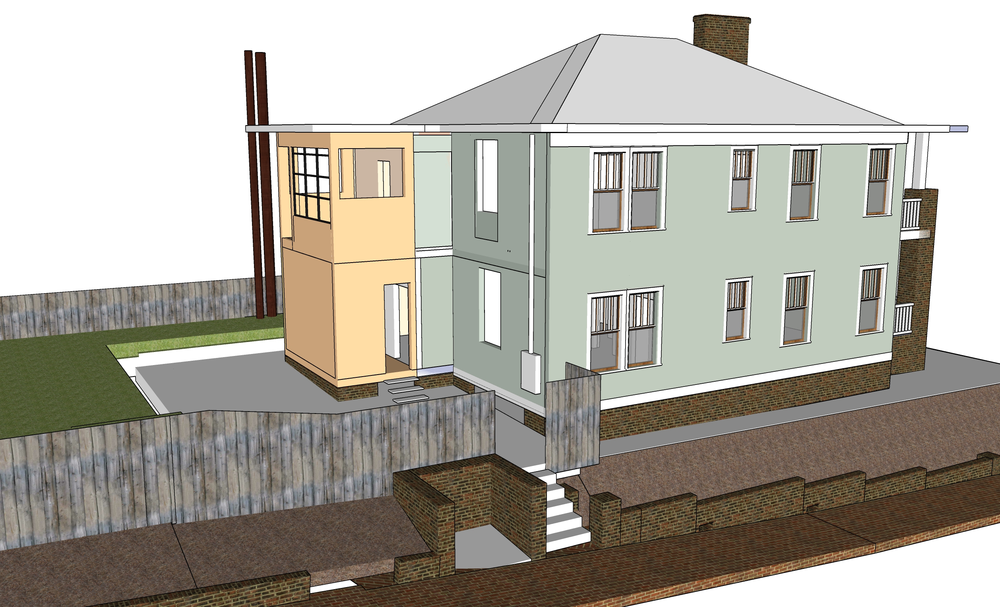
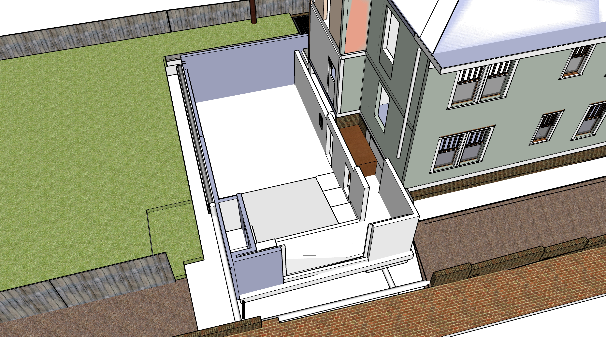
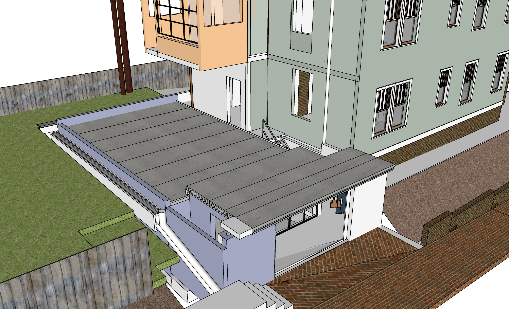
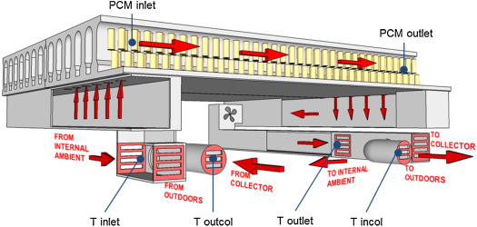
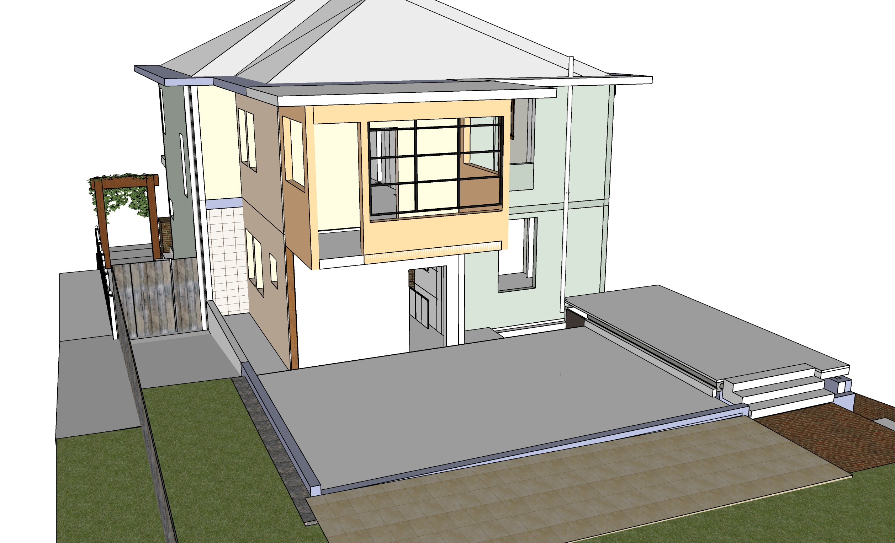
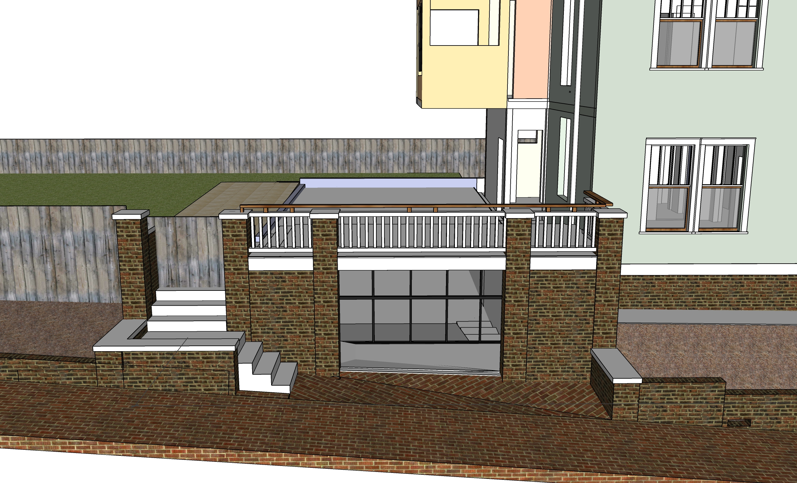
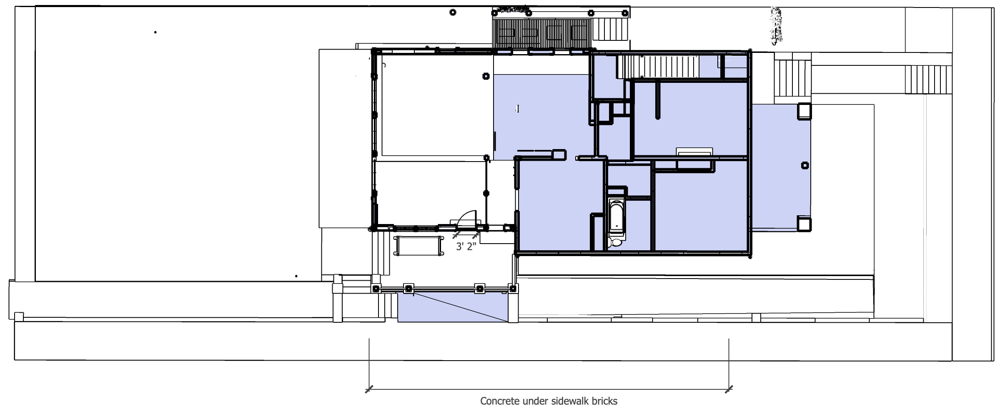

# Basement

Basement Prep, Dig, Porch Base, Hollow Core Slab, 1/3 Sidewalk Bricks and Steps  

| Prep for Basement Dig - Remove slate and rail road ties, Unhook AC units |||
|---|---|---|
| Jackhammer existing north cement for AC pad. Removed concrete can be used to fill void under kitchen bumpout. Initially store concrete on northeast side of house.  | $400 | $800 |
| Remove and dispose of creosote railroad ties. | $200 | $500 |
| Remove slate patio stones and concrete. Retain state for filler or reuse. Store under exterior stairway. Store concrete on northeast side of house. | $200 | $400 |

 
Before removal of laundry   

Homeowner will:  

- Remove the rear laundry areas.  
- Work with local handyman to add more jacks under house.  
- Remove brick wall where trash cans reside. (Retaining bricks for reuse.) 

 

### Basement Dig and Pour

<!--
Possible resource: Fernando Garcia 404-538-2458 - Basement on Georgia Ave (July 2014) - Don't remember which house.
-->

- Digging the 4' basement stairway area will occur after the adjacent basement wall is added so we have structural support and an overhead rain cover while dirt is removed near the house.

| **Temporarily unhook HVAC** | | |
|---|---|---|
| Remove freon and detach 2 AC units. Depending on weather, temporaily extend lines and move further east outside of fence | $100 | $700 |
| &nbsp; | | |
| **Basement Dig and Cement Work** | | |
| Basement Dig, Frame and Pour - includes sump pump and drain pipes | $10,000 | $30,000 |
| Pour cement pad for AC Units | $600 | $800 |
| North bump-out concrete foundation | $2,000 | $4,000 |
| Cement drain by porch with grate to catch leaves | $400 | $500 |
| Drains from brick porch area down to street below entrance, drain going east next to short brick wall | $800 | $1,500
| Pour higher basement level, 2 sets of cement steps and backing for brick walls on Bass Street | $1,000 | $2,500 |
| &nbsp; | | |
| **Basement Dig and Cement Work** | | |
| Dig area for basement stairs, pour additional concrete | $1,000 | $2,500 |

  

[40' McNichols Trench Drain System](https://www.mcnichols.com/trench-drain-systems/polycast-sup-reg-sup-system/polymer-concrete-f3pc288840?rbl=&cId=) - Polymer Concrete (PC). Alternative to creating the trough in cement.  
Also see [Rockcrete cage](https://rockcreteusa.com/products/18%E2%80%B3x1-25%E2%80%B3x36%E2%80%B3super-heavy-duty-trench-grate/) for durability.
  

 
  

### Low Carbon Emission Concrete

Atlanta-based Thomas Concrete has been using the Canadian CarbonCure system since 2016.
[CNN Article](https://money.cnn.com/2018/06/12/technology/concrete-carboncure/index.html)  

"CarbonCure involves injecting carbon dioxide captured from various other industrial processes into concrete during the mixing process. A chemical reaction would “mineralize” that carbon dioxide, which would have the added benefit of making the concrete compressively stronger." “We have seen no downsides to using CarbonCure,”  Drew Millwood, the Thomas Concrete technician who oversaw the Kendeda job, writes: “It allows for cement reduction in any mix it is used in and provides strength at or above design. No cost increase is involved in a mix containing CO2 as the savings from cement reduction offset the cost of CO2 delivery. Equipment costs are easily recouped due to the savings.” - [source](https://livingbuilding.kendedafund.org/2019/07/16/carboncure/)  

## Basement as a passive home addition

Insulated from floor to roof.  
The basement will use triple pane windows that should feel just as warm to the touch as the walls  

[Passive House Institute of the U.S.](https://www.phius.org/)  

Also, [inicel](https://www.sweetcomposites.com/Minicel.html) - From Rob Macks  

Could air be cycled under slab to chill?  

## Move Exterior Electric Box

| | | |
|---|---|---|
| Move the exterior electric box to the side of new porch. Move mosition of wire from pole to the left so it will reside within future wall. | $800 | $2,000 |

 

After new roof is completed, include a metal ring on wire to prevent squirrels from crossing to house.

## Hollow Core Slab (aka Coreslab)

| | | |
|---|---|---|
| **Hollow core install** | | |
| Hollow core slabs, lifted into place by crane on truck | $15,000 | $25,000 |
| Weatherproof plywood cover over basement stair opening, secure from below. Hinges on east side for access to basement stairway. | $100 | $400 |

 

  

8” slab + 2” concrete topping. 10” total.  

Hollow Core slabs and basement floor will provide a heat-sink in the main floor, storing heat generated from solar energy to radiate out at night.  

Electric heating will reside within basement floor to heat basement ceiling slab from below.  

  

  

[Concrete Industries - Indiana](https://concreteindustries.com/hollowcore/)
**Specs**  
[8" Hollowcore with 2" composite topping](https://concreteindustries.com/wp-content/uploads/2017/07/Hollowcore-Load-Table-2in-Composite.pdf)  
[8" Hollowcore with no composite topping](https://concreteindustries.com/wp-content/uploads/2017/07/Hollowcore-Load-Table-No-Composite.pdf)
  

<!--
 
-->

### Sources of Precast Concrete for Hollow Core

[Precast Concrete Suppliers serving Georgia](https://www.thomasnet.com/georgia/precast-concrete-17311002-1.html)  

[Precast Concrete Directory](https://www.pci.org/PCI/Directories/PCICertifiedPlants.aspx)  

### Concrete with Cellulose Nanocrystals

Cellulose nanocrystals provide an avenue for water to hydrate cement particles when mixing.  

Cellulose-infused concrete is stronger and sets faster  

[Purdue Researchers](https://www.purdue.edu/newsroom/releases/2018/Q1/purdue-researchers-show-concrete-infused-with-wood-nanocrystals-is-stronger,-plan-to-use-it-in-california-bridge.html)  
[Thomas parking lot in Greenville](http://www.thomasconcrete.com/latest-news/thomas-concrete-partners-in-the-debut-of-a-concrete-mix-infused-with-cellulosic-nanomaterial)  

## 2" Concrete Topping

||||
|---|---|---|
| Concrete Topping | $500 | $2000 |
| Three sets of steps at porch | $500 | $1000 |

 
 

Porch rail added in Patio phase: 
   

## Basement Brickwork

- Basement, coreslab, brickwork, porch steps and rail.
- 2" of concrete on top of the coreslab to create a waterproof patio area. The surface will angle slightly to two drains on the west side.
- Basement exterior door, basement interior accordion windows

||||
|---|---|---|
| **Brickwork** | | |
| Porch tiles laid out for rain absorption as back porch (beige in image above) | $400 | $800 |
| Brick patio area above stairway, weed barrier fabric, sand under bricks| $300 | $500 |
| Cement under sidewalk bricks for center 1/3 of Bass St frontage, including slope away from basement. (Other areas of Bass Street have vulnerable trees, so avoid resetting bricks by 2 oak trees and at front of property by Grant Street) | $800 | $1000 |
| Brick walls of porch | $1000 | $3000 |
| &nbsp; | | |

 

 
  

Waterflow at porch - Six levels of drain protection:

1. Area above stairs drains into pipe that outputs below porch.  
2. Downspout drains into three rain barrels within west side of porch, then outputs below porch.  
3. Sidewalk above stairs drains to outflow below porch.  
4. Sidewalk below stairs has a drain before doorway. Addition to sidewalk angles away from door.  
5. Goove below doors drains below porch.  
6. Interior floor angles away from deeper basement, which has a sump pump.  

Cement under sidewalk bricks: 

