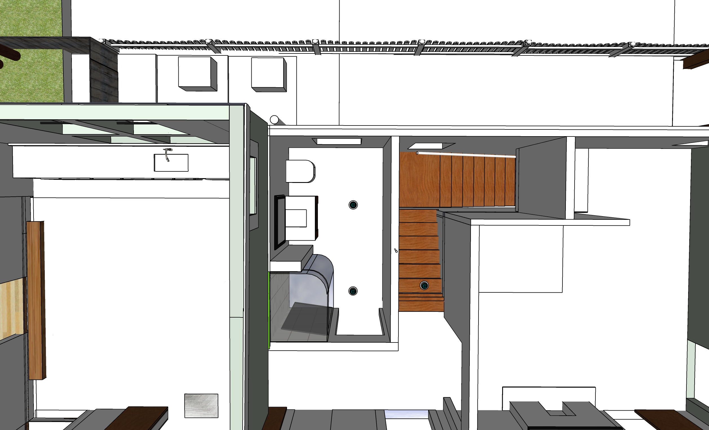

# Bathrooms

<!--
Saw on another's post that Rob Smith recommends contractor (plumber) Chris Simoncelli
https://www.facebook.com/groups/355326271222754/user/849524348/
-->

[Existing pipe locations](https://docs.google.com/document/d/1J0A26a7-Dvm3mscBRTSgxIeMxft11VZoRADT_unegkE/edit?usp=sharing)

## Downstairs Bathroom

Bathroom to be added in middle room on south side of house.  

   

We have a new tub and toilet to use.  Their color is almond.  
The tub has open ends. It will be set in wood or tile/stone.

   

## Upstairs Bathroom - Shower 

<!--
 
-->

 

