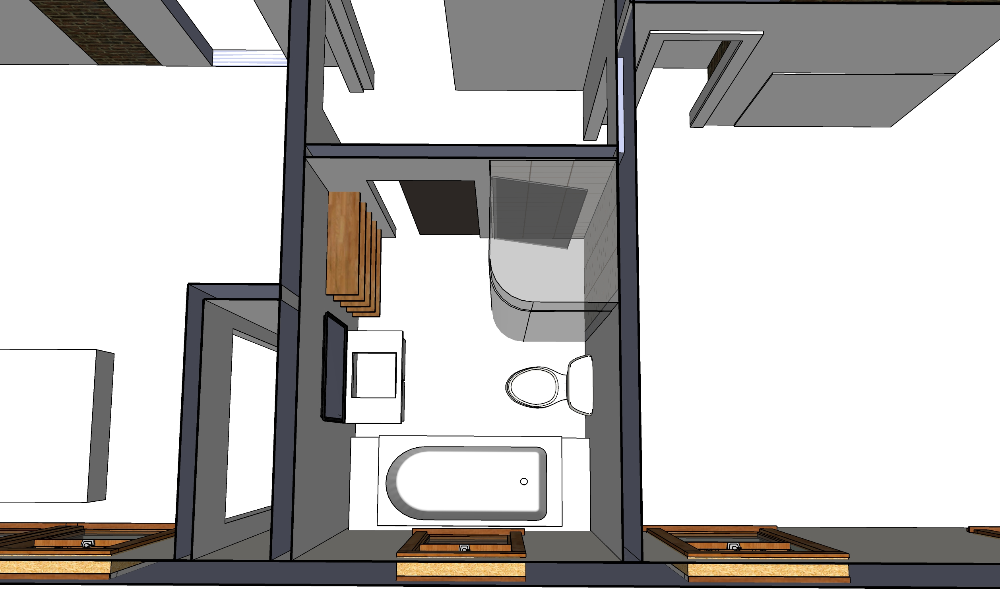
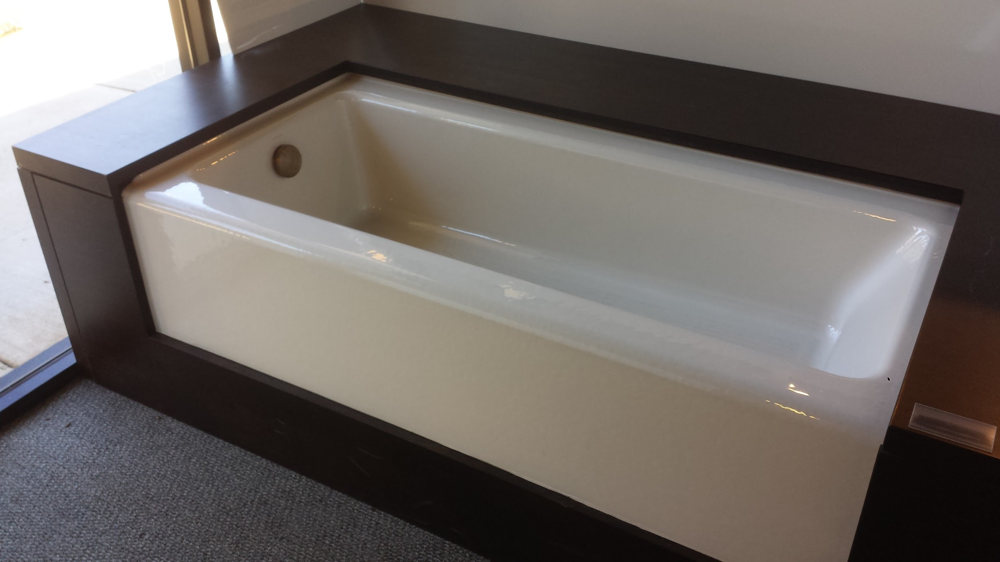
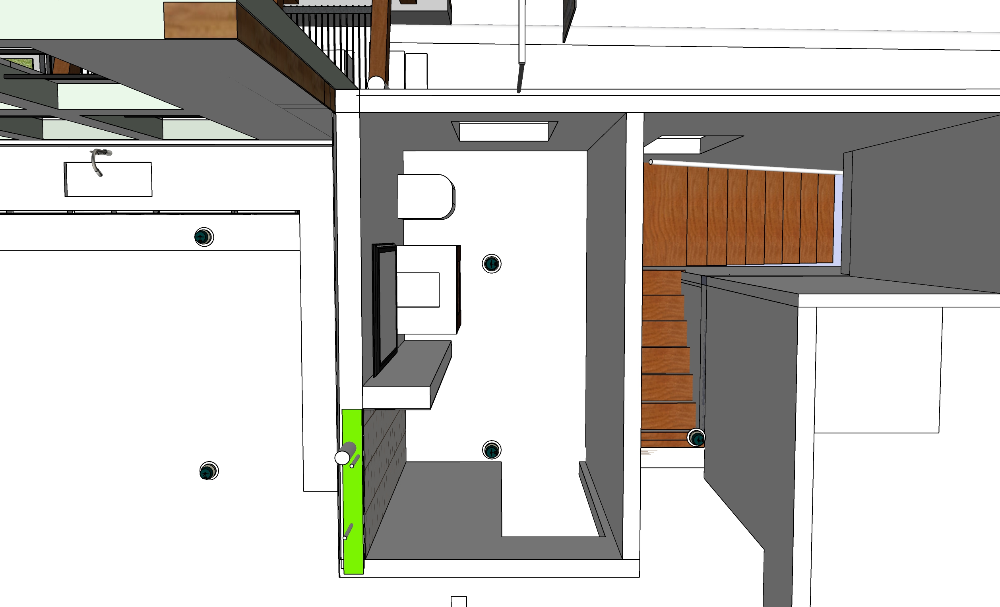
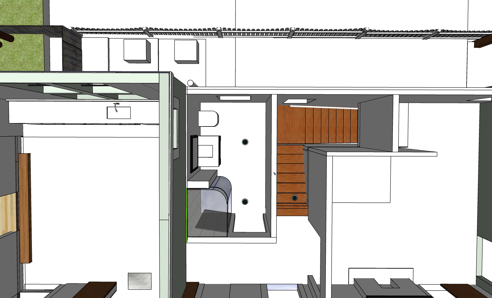

# Bathrooms

<!--
Saw on another's post that Rob Smith recommends contractor (plumber) Chris Simoncelli
https://www.facebook.com/groups/355326271222754/user/849524348/

Genny Drash used Minwax Wood Finish (Penetrates, Stains & Seals) - Classic Grey 271 - for Poplar wood walls, no drywall
-->

[Existing pipe locations](https://docs.google.com/document/d/1J0A26a7-Dvm3mscBRTSgxIeMxft11VZoRADT_unegkE/edit?usp=sharing)

## Downstairs Bathroom

Bathroom to be added in middle room on south side of house.  

   

We have a new tub and toilet to use.  Their color is almond.  
The tub has open ends. It will be set in wood or tile/stone.

Existing: [California Faucets](calfaucets.com) - Weathered Copper from European Kitchen and Bathworks, 2655 Buford Highway. "Becuase Living Finishes are by nature more delicate, the only treatment recommended is a high quality wax like Renaissance Wax. No other cleaning is needed or recommmended."

Upstairs tile: Tucson Marron 30x60cm, Dunwoody

   

## Upstairs Bathroom - Shower 

<!--
 
-->

 

