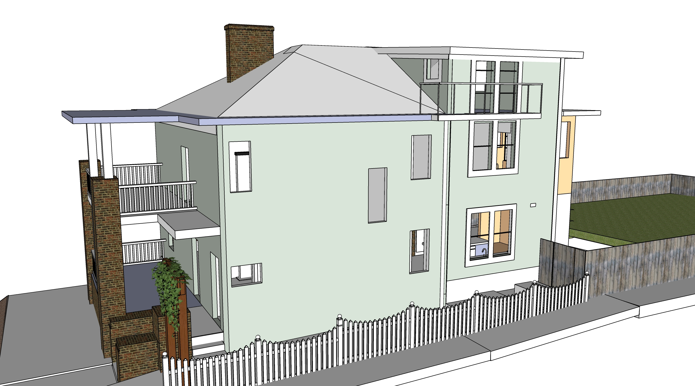
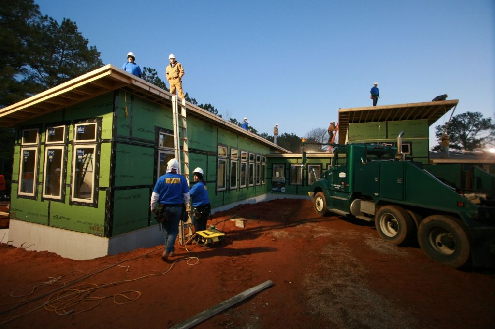
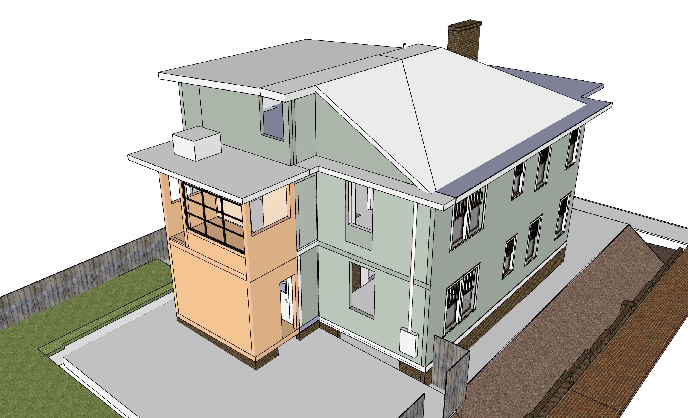
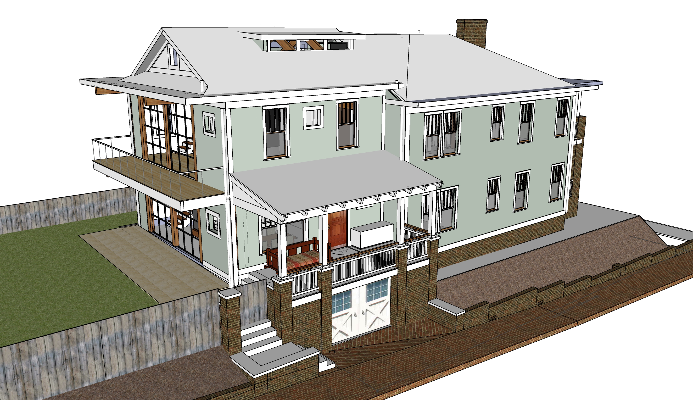
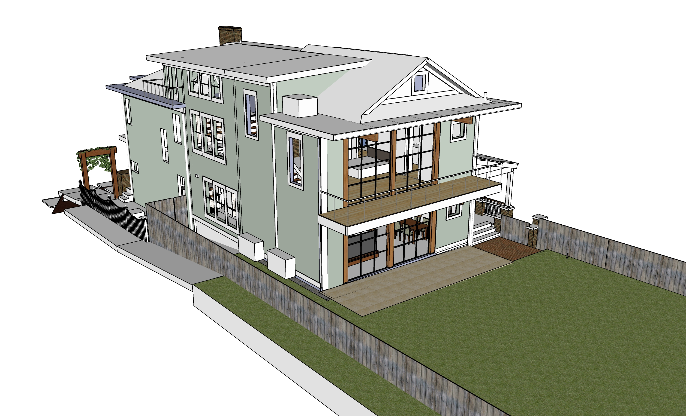
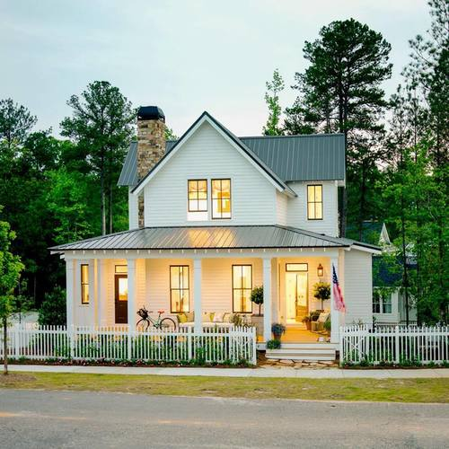

# Bumpout

3.5' by 15'4" on north side.

Also see [HVAC under projects](../projects/)

## Attic with Shed Roof

Shed Roof size: 16' 9" by 18' 9" (expanded to 26' 10")  

Attic level during Full Addtion  

- Windows on north side of kitchen, craft room and attic.
- Porch on attic level with roof access.

   
<!-- also bumpout-no-attic.jpg -->

Weather sealed insulation

  
<a href="https://palmharborbuilders.wordpress.com/2010/02/24/extreme-makeover/" target="_blank">Modular home</a> and 
<a href="http://northcreekconstruction.com/residential-solutions-north-creek-construction-general-contractors-atlanta-georgia" target="_blank">North Creek</a>

## From Southwest

Orange indicates existing laundry rooms.

   

<h2>Completed Exterior</h2>

Aiming for completion by 2025

  

<!--

  
<a href="http://www.atlantametalroofs.com/#residential-metal-roofing-leader" target="_blank">RCA Metal Supply</a>

-->

 

<!--
## Planning

- Prepare and submit plans to city. Use Sketchup work where practical.

| | Min | Max |
|---|---|---|
| Planning and plan submission. Work with engineers to finalize material orders. | $2,500 | $3,500 |
-->

 

||||
|---|---|---|
| **Bumpout** | | |
| Bumpout and windows, shed roof and attic patio | $15,000 | $35,000 |
| Shingles - remove existing two layers, entire house and new section | $3,500 | $10,000 |

||||
|---|---|---|
| **Painting** | | |
| Prep and Painting - entire house | $8,000 | $10,000 |

  

 

---
[Bathroom](../bathrooms/) | 
[Upstairs](../upstairs/) 
