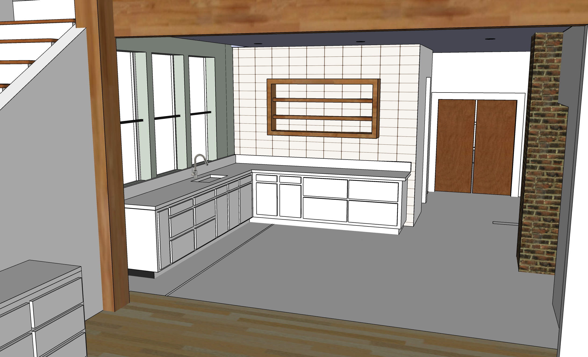

# Upstairs Craft Room

  

  

  

<a href="https://www.google.com/search?q=fridge+under+counter&sxsrf=ALeKk02GU5j0dWZngOF80UpdOTu5UKlKqg:1614549505261&source=lnms&tbm=isch&sa=X&ved=2ahUKEwi7u-7NyY3vAhWCxFkKHWrKDOwQ_AUoAnoECAcQBA&biw=1536&bih=885&dpr=2#imgrc=QSgLMOCidC_flM">More undercounter examples</a>  

<!--
Bathroom

Genny Drash used Minwax Wood Finish (Penetrates, Stains & Seals) - Classic Grey 271 - for Poplar wood walls, no drywall 

-->

 

<!--
 
-->

[Kitchen](../kitchen/)

