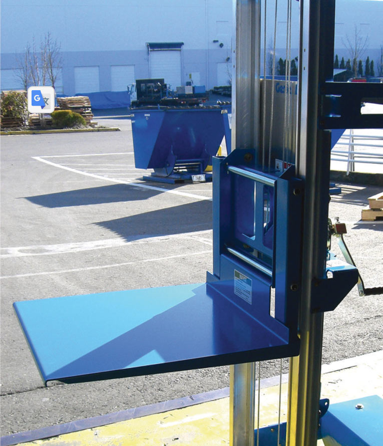

| Basement chiller, fan and duct in elevator shaft | $4,000 | $8,000 |
| Elevator door automation | $4,000 | $8,000 |
| The elevator could use two wires in the wall to lift an L-Shaped side mount, or four motors within base, Serves 4 levels | $10,000 | $18,000 |
| Four elevator-bots shuffled in attic for sets of clothes and shoes  | $10,000 | $15,000 |

