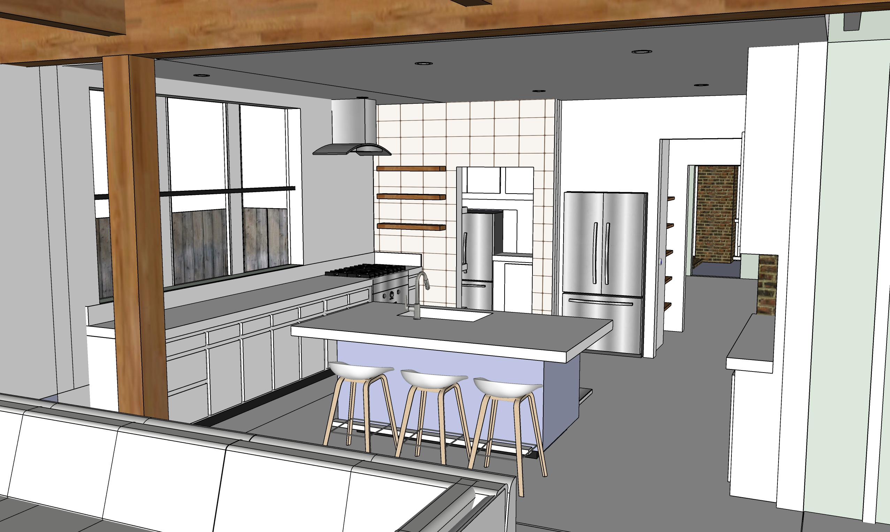

# Kitchen

- Downstairs gourmet kitchen, counters and cabinets
- Same location as current kitchen, after north wall moved 3.5' outward.
- The existing bathroom will be converted to a pantry
- Existing pantry removed. Cabinets added to south side of kitchen.
- Electric heating will be added under wood floors
- Insulation added under new kitchen floor in crawlspace  

## Phase 5

    

 

## Interior Prep

After bumpout of exterior wall and addition of new north windows:  

- Create envelope of plastic within room to prevent any dust from moving into house or falling between floor boards. 
- Remove gas and water pipe within pantry (disconnected in prior phase). 
- Carefully remove and retain door trim and baseboards from interior walls.  
- Remove ceiling plaster and slats from both kitchen and craft room.  
- Tie slats in bundles to prevent puncturing contrator bags.  
- Remove old pipes from within south wall of kitchen.  
- Retain both sinks for now.  
- Park disposal truck on bass for debris. (We'll save some of the slats and wood). 
- On both levels, remove ceiling plaster and one side of south wall.
- On both levels, remove ceiling slats. Add braces between ceiling beams to add stability.  
- On both levels, remove previous exterior north wall of kitchen and craftroom.
- DO NOT remove either side of exterior west wall at this stage.   

||||
|---|---|---|
| **** | | |
| Kitchen and Craft room wall and ceiling removal | $1,000 | $2,500 |
| &nbsp; | | |

## Plumbing

||||
|---|---|---|
| **Plumbing** | | |
| Update incoming water valve under house to increase pressure. | $300 | $600 |
| Plumbing for new bathrooms, including pipe to attic. | $1,200 | $4,000 |  
| Move water heater to attic. Hook up water and gas lines. | $700 | $900 |
| Plumbing for sink in kitchen island. (4" Drain pipe already runs to kitchen. Add "T" to for new bathroom.) | $500 | $800 |
| Plumbing for sink in craftroom | $100 | $200 |

## Drywall, Interior Trim, Interior Painting, Interior Doors
||||
|---|---|---|
| Strengthen or pivot pulldown stairway opening after moving water heater. | $200 | $400 |
| &nbsp; |||
| **Drywall and Painting** | | |
| Expand window opening into doorway to upstairs laundry area | $200 | $800 |
| Drywall kitchen and craftroom | $500 | $1,200 |
| Interior painting | $800 | $1,500 |
| Switch and plug covers | $400 | $800 |
| &nbsp; |||
| **Interior Trim and Door Carpentry** | | |
| Interior Trim | $400 | $800 |
| Door Hardware - Repair/upgrade doorknobs - Front door, souteast bedroom | $400 | $800 |

||||
|---|---|---|
| New ceiling drywall.  | $1,000 | $2,000 |
| Kitchen and Craft room - Add tiles to east walls. | $1,000 | $2,000 |
| Kitchen - New counter and sink. | $1,400 | $4,000 | 
| Craft room - New counter and sink. When full addition is added, these will shift a few inches west. | $1,400 | $2,000 | 
| Disconnect old sinks. Retain garbage disposal. | $200 | $400 |
| Craft room - Undercounter fridge | $1,400 | $2,000 |

## Craftroom and Kitchen - Counters and Cabinets
||||
|---|---|---|
| **Downstairs Kitchen -  Remove hallway walls, Ceiling, Extend floor 3.5'** | | |
| Deactivate existing downstairs kitchen plumbing, electricity, remove counters and remove wall behind sink (reuse windows) | $400 | $500 |
| Remove wall above doorway, remove south side of hall closet, add framework | $400 | $800 |
| Sliding door on east side of kitchen. Reinforce wall | $800 | $1,500 |
| Drywall kitchen ceiling | $400 | $800 |
| Extend downstairs kitchen hardwood floor surface 3.5' into bumpout and resurface floor with [PolyWhey® 3500 Satin](https://vermontnaturalcoatings.com/product/polywhey-3500-wood-floor-finish/) - PolyWhey 3500 has 65% less VOC content than the standard that most water-based finishes try to meet, while PolyWhey 2500 has 50% less. | $2,000 | $4,000 |
| &nbsp; |||
| **Downstairs Cabinetry** | | |
| Downstairs kitchen - Maybe quartz counter. Cabinets including south wall, sink, hookup dishwasher | $4,000 | $6,000 |
| Downstairs kitchen oven, either a hood or vent | $1,200 | $4,000 |
| &nbsp; |||
| **Upstairs Craftroom Cabinetry** | | |
| Upstairs craft room - cabinet on south wall | $1,500 | $1,800 |
| Craft room wood shelf | $400 | $600 |

  

Spot lights on walls (adjustable eyeball). Hookups for 2 or 3 pendant lights over island.
No divider in sink. Concealed trash and recycling bin pull-out to right of sink.  

<!--“Bridge style” sink faucet - pipe connects faucets  -->
<!--
Ikea comparable to more expensive custom cabinet makers.
Make sure Ikea surface quality is consistent. 
Ceasarstone - most durable

Jill Blass has Shaker-style panels.
Mark Mroz (fancywoodworks.com) builds shelves and custom cabinets, and the cost is only a little more than Ikea.
He assembles it all from wood and uses his spray shop.
-->

    

  

<!--
Old Kitchen window dimensions (to be removed):
94” rod (86” trim to trim with 4” on each side) - Used 83” to 152”

LENDA curtains - shorter 98” height (55 width x 2) - $19.98
http://www.ikea.com/us/en/catalog/products/30111978/
http://www.ikea.com/us/en/catalog/products/S99929241/

Curtain Brackets - (RÄCKA might not come with brackets)
3 brackets in kitchen (for center) BETYDLIG bracket, black - $1.49 each
http://www.ikea.com/us/en/catalog/products/60217228/

Lenda white curtains (Ikea) - Allow about 3” per side
Rods also from Ikea.

Maybe Smith & Noble “black out” roller shade - white inside and out

White-wash technique:
Home Depot Minwax White wash - 
1 pass for the least opaque to still see wood grain.

-->

[Home](../) | [Upstairs](../upstairs/) | [Phases](../phases/)

