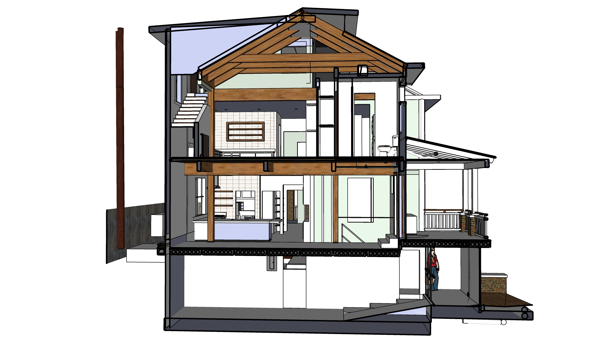

## AC Units, Grey Water Storage

  
 

About <a href="https://www.hpacmag.com/features/radiant-cooling/">radiant-cooling</a>  

Plans do not yet include location for “influx of fresh air” to stimulate building temperatures. Probably need to run through a dehumidifier.  

### HVAC Duct Fabricators
Atlanta Supply - Logan Circle (for Ducts, custom)  
Custom sheet metal (pricey) [B & S Sheet Metal Fabricators Inc.](https://bsmetalfabricators.com/)  

Current HVAC in crawl space: Ducane  
Sept 2014 - Circuit board replaced  
Motor did not need to be replaced (m#FPBB100A5 S#20251005A PRODUCT#1006559993) 

For future - Go with the 4 inch filter tray for better airflow (.12) and filtration (97%):  

Allergen Deep Pleat 1550 (4")  
3-10 microns 97%  
MERV 12  
pressure drop .12  

Not quite as good (but the best airflow for the 1" filters we currently use):  
Ultra Allergen 1500  
310 microns - 90%  
MERV 12  
pressure drop .15  

<h2>West Elevation</h2> 
Cold air enters at upper left AC.  
Hot air generated in the basement, lower left. Air loops through concrete slabs as heat-sink while solar operational.
  

<!-- 
<a href="http://www.marathonheaters.com/cons_specs.html">Rheem's Marathon Water Heater</a> - "The most durable electric water heater" - Under stairs  
-->

## Electrical

Recessed can lights (pot lights) will be used in all rooms.

<b>Resources</b>  
<a href="https://www.edrawmax.com/article/electrical-plan.html">How to layout electrical plan</a>  
<a href="https://3dwarehouse.sketchup.com/model/18515e9750cb23076d022864d00430d0/Electrical-Components?redirect=1">SketchUp Electrical Components</a>  
