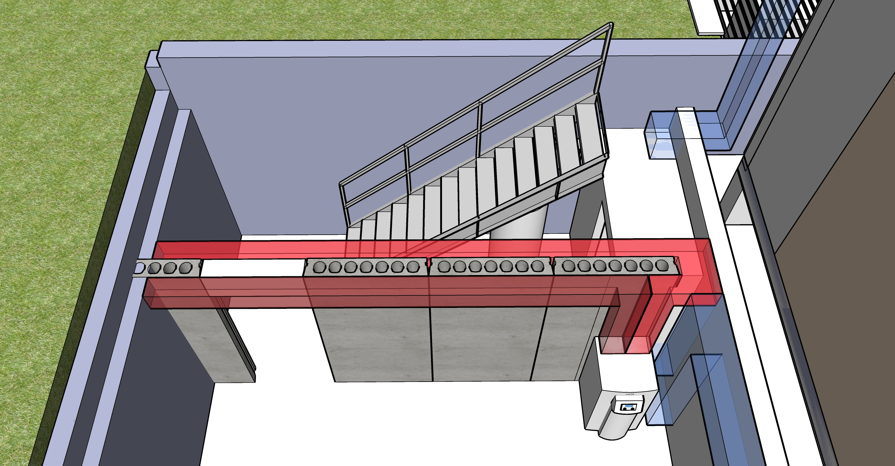
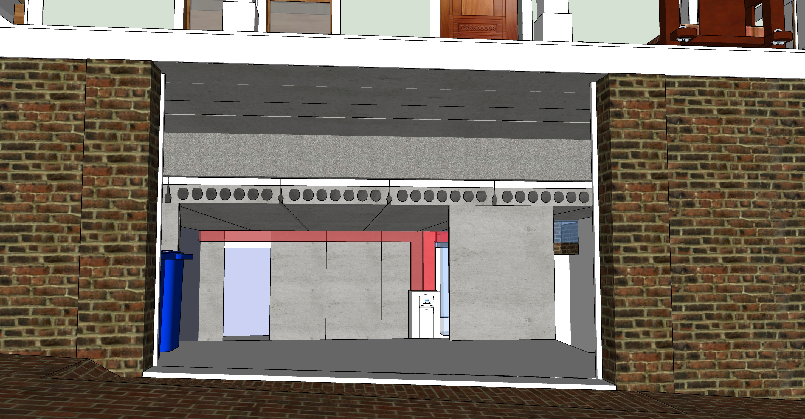

## Phase 2 - Move shed and tree(s) with crane.

<!--
	Use railroad ties to mitgate errosion. Might take dirt to school or park.
-->
| Footings for Shed. Prepare to move lower laundry area. Weatherize roof exposed by removal. | Min | Max |
|---|---|---|
| Six holes (18" or more deep) for column bases of shed. Fill and compact with existing stone from rear driveway. | $200 | $550 |
| Six block columns for shed. (Or use bricks from west side of trash storage area) | $300 | $600 |
| Shift brick wall and fence so tree-removal crane may drive in backyard from elevated bed of truck.  | $600 | $1,000 |
| Remove top roof, retain for shed. Remove second floor windows and lower door. Retain on north side of house. | $400 | $500 |
| Weather-seal upper edge of house during removal. Reattach gutter. Cleanup. (Old siding will remain) | $200 | $800 |
| Add two 4x4s to reinforce open side of shed facing house. | $100 | $200 |
| Separate rear structure from building. Wrap lift-cords for crane. | $100 | $500 |
| If doing full addition, remove deck at top of exterior stairway to clear path for movement of shed and tree. Retain trunks for shed deck columns. | $100 | $200 |
| Fridge will be moved into small room downstairs, or we may switch to smaller table to make space in kitchen. |||
| &nbsp; | | |
| **Small Crane and Truck** | | |
| Move lower section of back laundry area, pivot, place onto truck parked on upper level. Drive to corner of lot and slide off shed. Cut large branches and cut down tree too close to other tree. | $2,000 | $4,000 |
| After truck crew leaves, cut up branches of downed tree.<!--Tree trunks may be retained for rear north jasmin structure columns.-->| $200 | $300 |
| &nbsp; | | |
| **General Carpentry - Assemble shed, add reclaimed windows** | | |
| Assemble shed reusing windows and roof from upstairs laundry area. | $1,000 | $1,500 |
| &nbsp; | | |

We are not planning to do this...  
PCM can be placed in hollow core tubes as a thermal storage and supply system <a href="https://www.sciencedirect.com/science/article/abs/pii/S0378778815300591">PCM Research</a> 
Note that external air is NOT sent through the hollow core slab. Air moves in a loop.
  

  
Air flow leaves the electric heating unit on the right side, move though hollow core basement ceiling, and return for reheating via the left duct.   

  
U-shaped pipes would connect sets of two pipes to create ten 50 foot loops. Air circulating through slabs would not be mixed with home air.
  

<!--
Student researcher explaining an innovative [seismic retrofit](https://www.constructionspecifier.com/new-research-council-formed-for-concrete-industry/). 
Send suggestions to [ACI Foundation](https://www.acifoundation.org/research/suggestresearch.aspx)  

-->

<b>Options to investigate</b>
1. Heating with ten 48' airflow loops within concrete. Thin top surface. Same heating unit would also heat home air for quick heating.  
2. Heating with water pipes within 2” Acid Wash Cement cover (Structural, composite concrete topping)

 <!--
 	Coreslab Structure (Atlanta) - Met Sales Rep Jay Rubinson jrubinson@coreslab.com 770-471-1150

 	Metal stairway version in SketchUp (nned to update height): 
	Industrial Stairway with 105" landing height and 36" width. 
	Factory Supply part number ISO105-36.

 -->
 