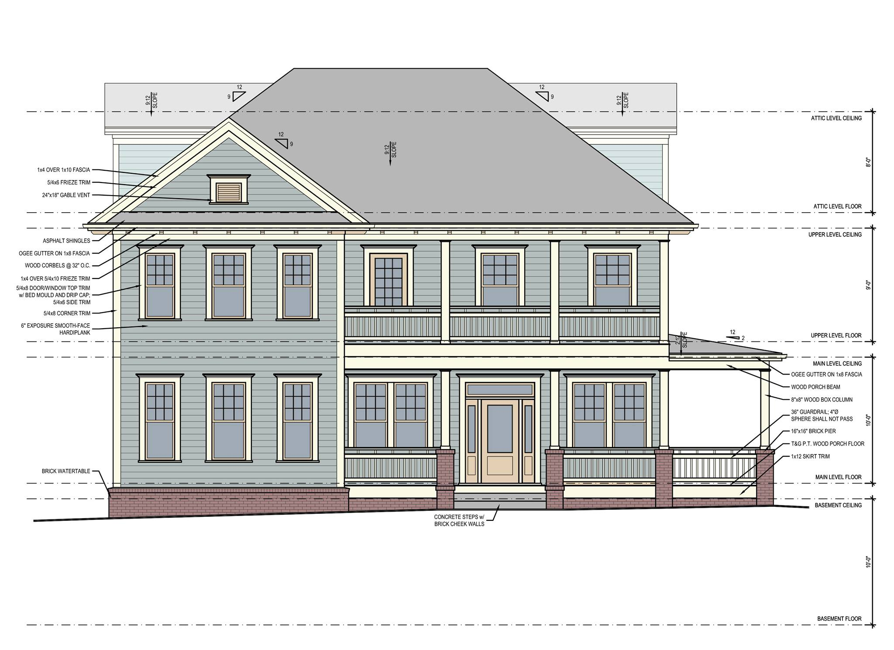
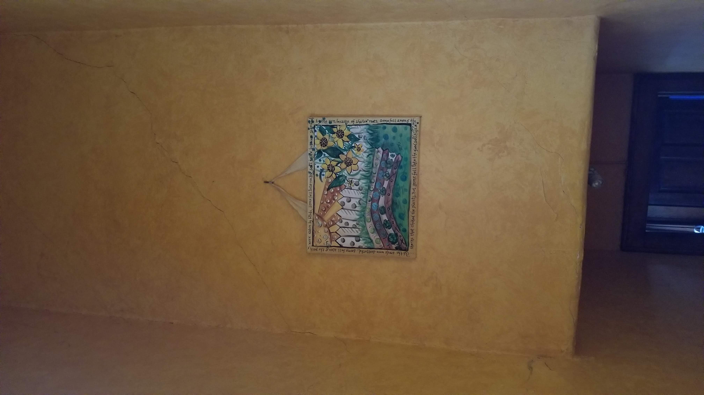
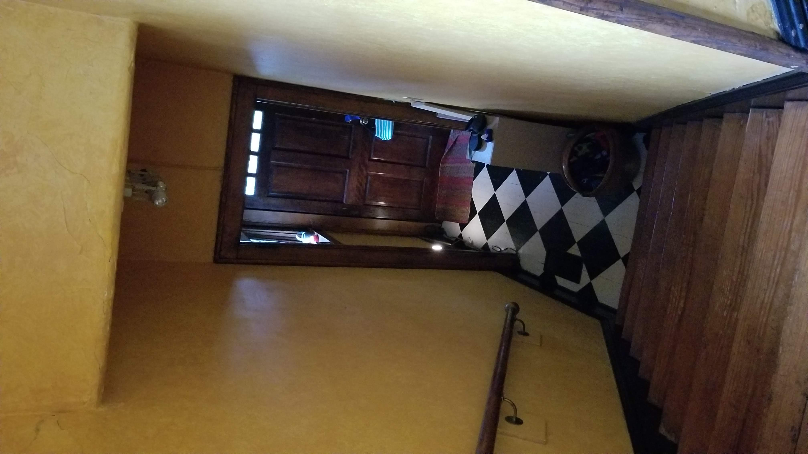
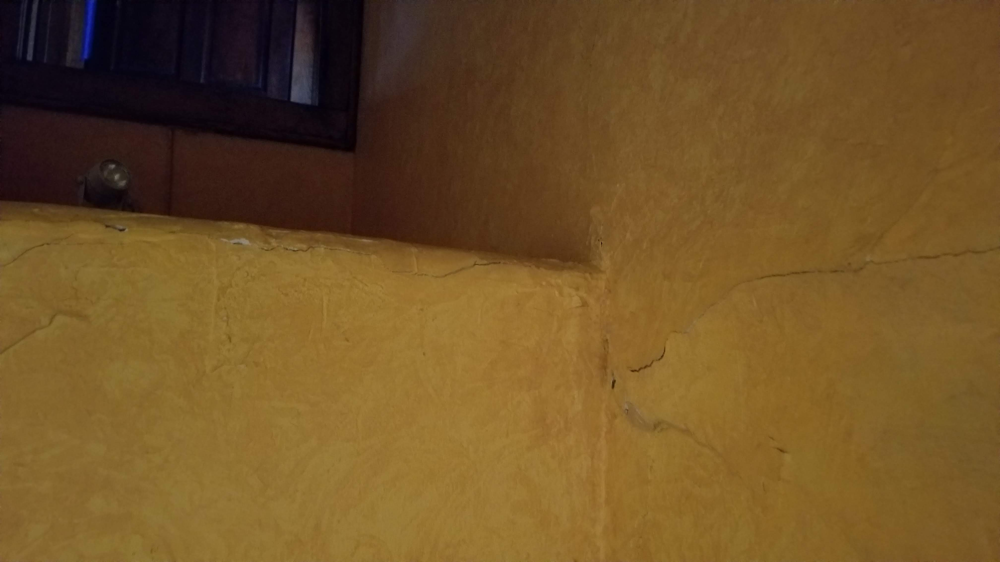
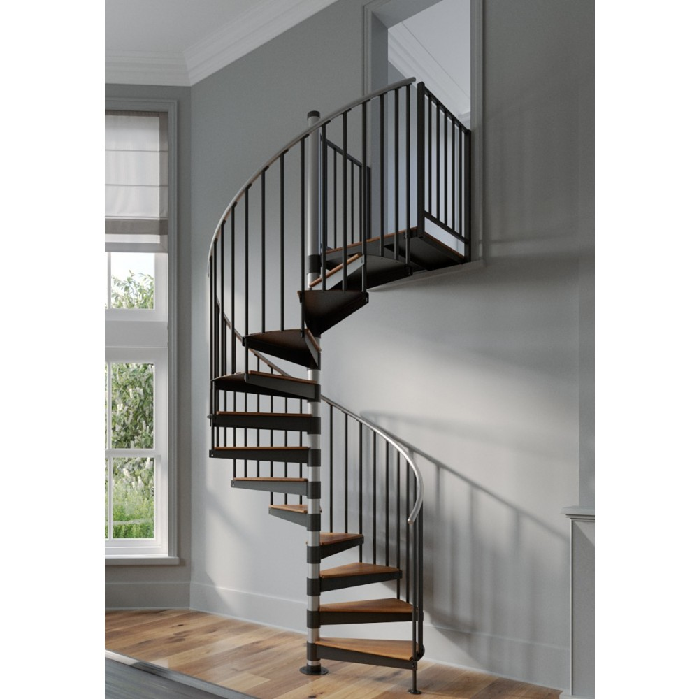
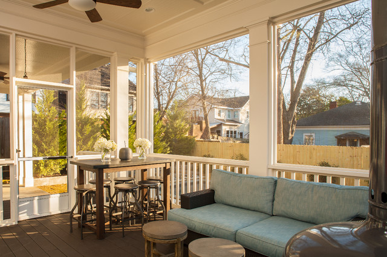
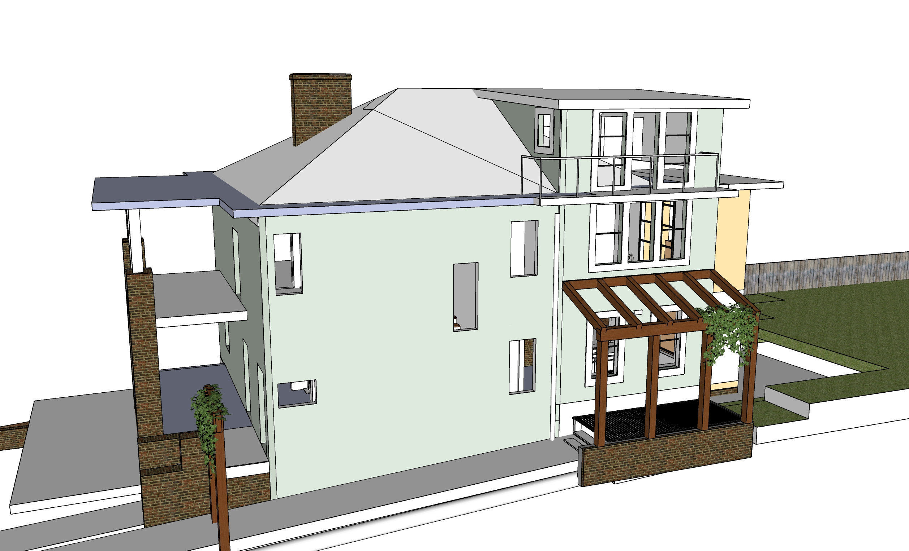

# Projects

<a href="../patio">Patio</a>

## HVAC

Moving new units to pads outside fence, relocating pipes in attic.  
Connect new freon pipe from under house.  
Attach pipe under HVAC in attic.

### Upstairs

All R22 freon has already been removed. Use $50/lb R425a to refill. <!-- New freon is called 4-10-A  -->  
Existing outside R-22 AC unit has a leak in valve, so can't pump R22 freon down to reattach unless valve replaced.  
Attic HVAC: 3 Ton, 90,000 BTU

<!-- so refilling could be 7 lbs at $120/lb = $840. -->

<!--
Consideration for AC
[Carrier Comfort-3.0 Ton 14 Series 15.0 SEER Residential Heat Pump System - 25HCE436 FX4DNF037L](https://www.expressoverstock.com/carrier-comfort-3-0-ton-14-series-15-0-seer-residential-heat-pump-system-25hce436-fx4dnf037l.html) - $4,619 
Sound 69 dBA

58 

[58STA090-1-14 Carrier 4-Way Multipoise Induced Combustion Single Stage Gas Furnace](https://new.ncshvac.com/?product=58sta090-1-14) - $2,237  
-->

### Downstairs

Outside R22 unit is loud. Replace with new one that uses R425a.  
Crawlspace HVAC: 2.5 Ton, 90,000 BTU Horizontal Coil - By Lenox<!-- Earl thinks -->
<!--Carrier Comfort Series quote from Daniel: 5,900 + 1,700 labor = $7,600  -->  
  

<!--Daniel 404-574-8424
Does not use email and needs equipment cash up front.  My search using his IDs found:
-->

<!--
AC Repair Project - I'm looking for someone to replace a leaking service valve in an R22 unit so we can pump the freon down when relocating it. We're not able to read the label so we're not sure of the brand. It's been working well otherwise. It's connected to 3 ton, 90,000 BTU. Also interested in buying a quite running R22 for a 2.5 ton, 90,000 BTU system.
-->

## Repointing Crawlspace

Prep far end of crawlspace, clean ground, remove loose mortar.  
Place aluminum under wood (avoid nailing). Bend far edge down 1/2 inch first, then close edge after adding mortar.  
We have ingredients for Type O mortar mix already.  
Add Type O mortar and bricks on top edges within crawlspace - up to aluminum.  
Patch exterior holes with Type O mortar mix (For south side, use Holcim Atlanta Red with sand and lime added)  
Repair crawlspace vent openings for tight fit.  
Northwest corner - Add bricks to seal behind PVC board. Use small jack.  

**Maybe: Holcim Atlanta Red Mortar**  
ALLEY-CASSETTY BRICK - ATLANTA DIVISION  
1115 SOUTHERN ROAD, Morrow, GA 30260 (770) 961-4477  
Also at 4745 HAMMOND INDUSTRIAL DR., CUMMING, GA 30041 (770) 889-2998  
And [more](https://generalshale.com/locator/)  

## Plumbing under house

Add handle value on 3/4" copper pipe and replace external faucet  
Add valve for rear faucet (need to get)  
Remove faucet on north side (professional)  
Add new main valve to house to improve water pressure (professional)  

## Weather barrier using PVC boards

Hole on west side - About 2' tall by 3.5' wide.  
Set on two rows of cinder blocks and use cinder blocks to hold in place.  
Wall on east side - will sit on 2 cinder blocks  

<!--
## 8' Drain Pipe (on hold)

Dig hole for drain pipe from street to AC  
Dig Hole for 4" PVC split to front yard  
Access box and 4" T  
Install 10" concrete pipe (50' 8")  
Overflow box at end of 10" pipe, 6" pipe to sidewalk  

## Dig recessed HVAC area

Cut cement for side foundation  
Dig hole for recessed AC Units and side foundation 
Set up concrete forms  
Concrete pour

-->

## Porch wood widths

Need 3/4" by 4" pressure treated (green) wood - 8' or more

Pieces are 45" long. We need 34 pieces. So 16 8-foot, plus extras.

The wood we have is 1/16" too short. But that is okay since we will replace entire areas by door.

## Metal support poles in crawlspace

Dig holes, add cement for 2 to 6 columns
Add support poles with aluminum at top

- One beside porch
- One under new bathroom
- West side of house, kitchen  
- Entrance room wall

## Siding repairs and caulking for painting 

Northwest corner caulk  
Nail holes and other repairs around house  

## Rear laundry room

Add molding inside rear laundry room

## Porch floor

Replace wood floor by front door  
Working on hatch door for front porch  

 

## Mortar Mix

Sandy darker grey mortar color in center below.  
Use a mix of buff and charcole pigment (Too much buff becomes orange.)  
We have pigment, sand, lime, and Type N to mix for softer Type O.  
See [Mortar Mix for Historic Homes](https://gpna.org/historic-home-care)  

 
  

Our existing mortar and bricks are too red. Wall looks fine... 

  

## Exterior Details

For reference:  

 

 

# Ongoing

## Crawlspace

Add insulation and metal tape to HVAC ducts  

Improve crawl space door  
Replace plywood with verticle boards. sand, stain and seal and lock.
Use dark stain color to blend with bricks.  

<a href="https://docs.google.com/document/d/12DIpuRJvCAZmODl7M-jmEJEsM0hCdxiBljkXsaRpKSs/edit?usp=sharing">Notes on crawlspace encapsulation</a>  
Uses a 3" or 4" PVC out the roof (to be added in wall on east side of kitchen)  
14 mil double reinforced poly vapor barrier  

## Chimney Cover

To order - Approximately: 56 3/4" by 16 3/4" (Ideal interior: 18" or 17.5" by 57.25")  
Outer edge of bricks: 58" by 19"

<!--
## Entrance Room - Remove closet and add bookshelf

Add new support crossbeam. Interior wall demolition.  
The wall above the stairway could be replaced with lighter drywall. A 45 degree angle will be added for head clearance.  
Compression of north wall causing plaster to bulge:

 

  

|  |||
|---|---|---|
| Remove entrance room closet. | $300 | $600 |
| Remove wall above stairway to reduce weight. Use plywood and plastic to catch dust/debris. | $300 | $600 |
| Add beam and open half of wall in front room by stairway. | $2,000 | $3,000 |
| Patch openings in floor. Resurface. | $800 | $2,000 |
-->

<!--
## Exterior Spiral Stairway
||||
[Mylen Reroute 60"D](https://www.stairwayshop.com/mylen-reroute-60-d-primed-steel-spiral-stairways.html)

 
 
-->

## Front Porch Updates
||||
|---|---|---|
| Existing front porches:  Remove extra column by bricks. Reinforce ceiling while removing existing 4x8 plywood. Replace with waterproofed slats. Add/update molding and trim where damaged or missing.  | $800 | $3,000 |

## Recessed Lights

6 recessed lights in existing upstairs center bedroom (probably 3’ from corners). Dimmer switch on east wall.  
Recessed lights in new front porch ceiling

 Nice option if we ever screen one of the porches:

## Pergola over HVAC units
||||
|---|---|---|
| Pergola wood structure for jasmin over exterior HVAC grate.  For longevity, might cover top of wood surface A provacy insert (decoration) will provide privacy | $1,500 | $3,500 |
| Wood archway beside front porch. Wood archway on south side. See [Sierra Vinyl Arbor](https://www.wayfair.com/outdoor/pdp/new-england-arbors-sierra-vinyl-arbor-zne1182.html) | $800 | $1,300 |

 

  
 

## Fire Pit, Sprinkler System, Outdoor lighting <!-- The items below add to sale value, also "Dedicated office, home gym, roof deck, outdoor heater, no-touch appliances " -->
||||
|---|---|---|
| Add fire pit in back yard | $800 | $1,000 |
| Smart sprinkler system | $800 | $3,000 |
| Outdoor lighting | $800 | $2,000 |

## Elevator

Slotted Metal Framing Strut Channel  
Motor and wench in attic for two redundant cables  

||||
|---|---|---|
| Power, brakes and cable system | $3,000 | $5,000 |
| Metal Cage and Doors | $3,000 | $7,000 |
| Automated doors at 3 levels | $4,000 | $7,000 |

<!--
Super Strut Carriage - 
10 ft. 12-Gauge Half Slotted Metal Framing Strut Channel - Silver Galvanized 

<iframe width="560" height="315" src="https://www.youtube.com/embed/39HlLf85LG4?start=614" frameborder="0" allow="accelerometer; autoplay; encrypted-media; gyroscope; picture-in-picture" allowfullscreen></iframe>

 
<iframe width="560" height="315" src="https://www.youtube.com/embed/CgdsamzPN8w?start=132" frameborder="0" allow="accelerometer; autoplay; encrypted-media; gyroscope; picture-in-picture" allowfullscreen></iframe>  

We could have 4 super strut carriages from Home Depot, with four wheels below and four above.
-->

## Light-well
||||
|---|---|---|
| Add light-well material within elevator shaft to redirect light from south attic window. | $1,000 | $3,000 |

## PowerPod wind energy
||||
|---|---|---|
| [PowerPod wind energy](https://www.halcium.com) (paired with solar) | $2,000 | $7,000 |

 

 

<!--
Brackers for hanging shovels reside on north side of chminey.  

Later, energy could be generated during drip irrigation on cloudy days by turning a small turbine with the descending water.  Turbine could by bypassed when higher pressure is used to water lawn. 2 antique tanks within the backside of the fireplace could hold additional water.
-->

- [Rate Trends (Freddie Mac)](http://www.freddiemac.com/pmms/) 
and [BankRates](https://www.bankrate.com/mortgages/mortgage-rates/?mortgageType=Refinance&partnerId=br3&pid=br3&pointsChanged=false&refinanceCashOutAmount=0&refinanceLoanAmount=384000&refinanceLoanTerms=30yr&refinancePoints=All&refinancePropertyType=SingleFamily&refinancePropertyUse=PrimaryResidence&refinancePropertyValue=480000&searchChanged=false&ttcid&userCreditScore=740&userFha=false&userVeteranStatus=NoMilitaryService&zipCode=30315)

<a href="../patio">Patio</a>

  

---
[Home](../) | [Bathrooms](../bathrooms/)  | [Bumpout](../bumpout/) 