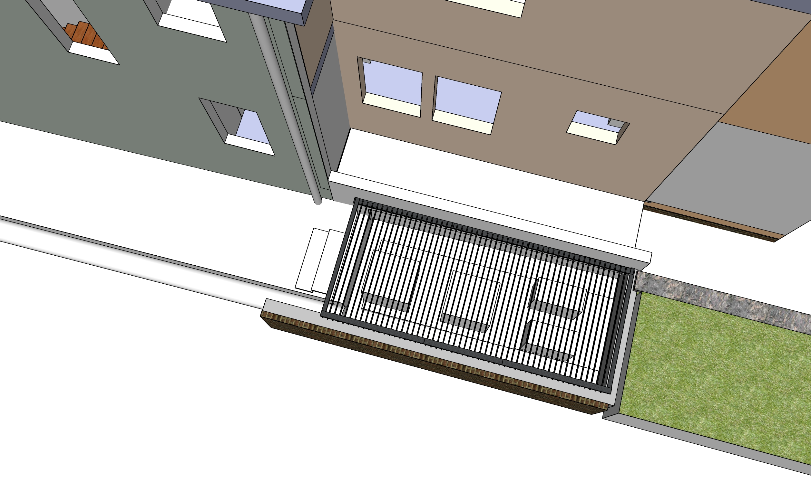
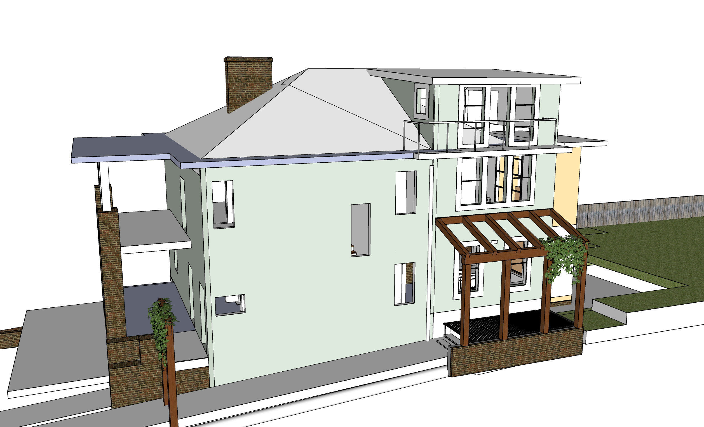
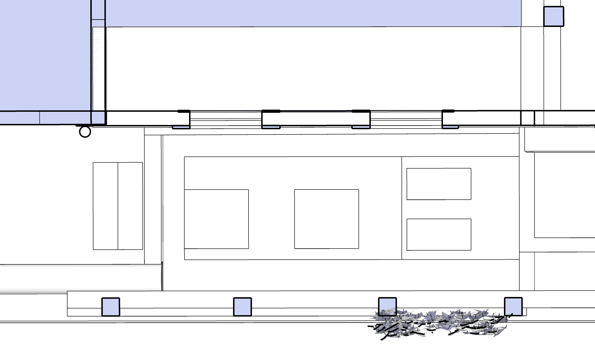
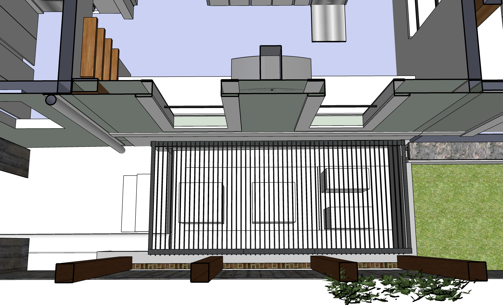
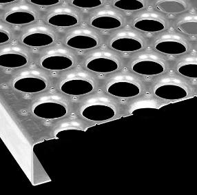
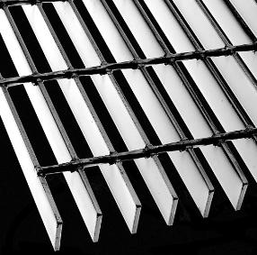

# Side Foundation

<h2>Phase 1 - Side Cement Foundation and AC Enclosure</h2>

The project includes cutting and removing 15' of an existing sidewalk for recessed AC area.

Recessed area will be approximately 1.5 foot below ground level.  

60' long drainage pipe to road: Possibly 10" or 12" diameter concrete pipe. Includes a 135 degree downward bend 10' from street.  Include a box with a T to a 3" PVC pipe (with access cap) for sending water into frontyard ivy slope during light rains.

Might use removed sidewalk as fill under the 3.5' bumpout concrete slab (as long as that would not weaken the slab).

  

[Bumpout wall](../phases) added in phase 2. Wood pergola added during [Ongoing Projects](../projects) phase.
  

  

<h3>Recessed AC Area covered by grate</h3>

Six 2.5' by 6' metal grates for walkway

Total size: 6' by 14' (Max 7' by 15')  

Wrote [www.mcnichols.com](https://www.mcnichols.com/locations/atlanta) - [Catalog: Bar Grating](https://www.mcnichols.com/bar-grating)

Metal grates for an exterior residential side walkway over AC units.  
Interested in a product that won't vibrate or block airflow.

Total area to cover: 14' by 6' (Max 15' by 7')

<!--Please send pricing info (and material links) for -->

Any of the following:

Three 5' by 6'  
Five 3' by 6'  
Six 2.5' by 6'  
Seven 2' by 6'  

  
 

  
  

  
Galvanized Steel - 35% open area 
12" wide. Comes in 10' or 12' lengths.<!-- $2035 --> 
Could cut 7'2" and use 4'10" for attic porch.

  
Coated Black - 77% open area 
36" wide. Custom length. 
Optional banding attached at ends<!-- $3327 -->

 

For structural channel (crossbeam):<!-- 3 From Pierce.Firth -->  
[Ryerson Metals](https://ryerson.com) (Peachtree Industrial way outside the perimeter)  
[Infra-Metals Co](https://www.infra-metals.com/) - West of Bellwood Quarry   
[Kloeckner Metals](https://www.kloecknermetals.com/) - Roswell/Alpharetta  

### Reposition existing AC units

2 Exterior AC units will be disconnected during side foudation pour.
<!--
||||
|---|---|---|
| **Reposition 2 AC Units into new enclosure** | | |
| Extend and insulate freon lines | $600 | $800 |
| Grate over AC units | $800 | $1,500 |
| &nbsp; | | |
-->
2 mini-split units will be added in a later phase.  

 

[Bumpout](../phases) 

