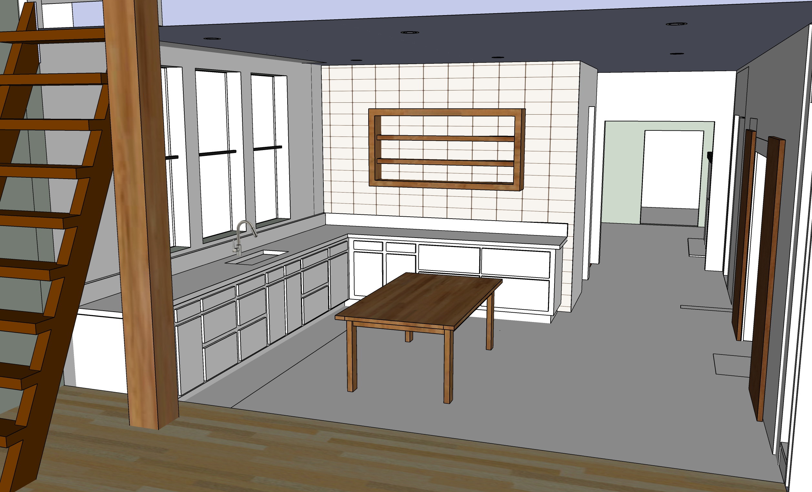
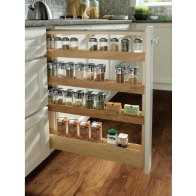
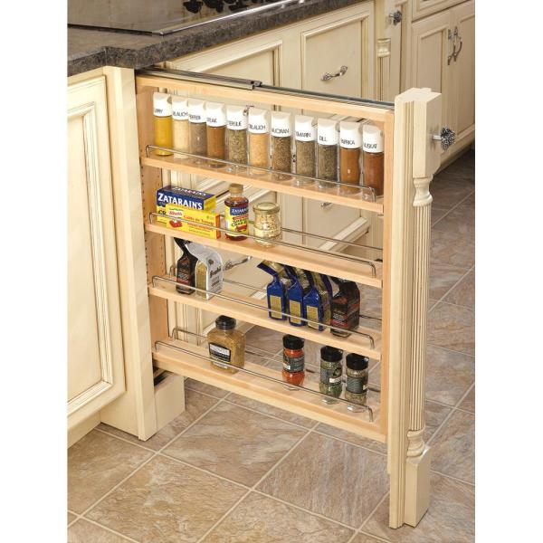
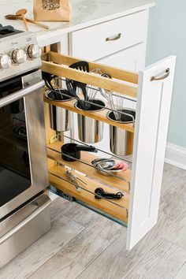
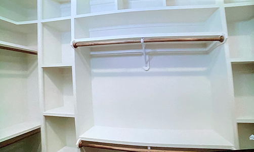

# Upstairs - Bathroom and Craft Room

## Phase 4

 

### Wall for relocated gas pipe and new vent pipes

Upstairs wall portion added first for gas pipe and vent pipes for refrigerators. 
Water heater will be moved into attic by removing beam near attic ladder. 

Gas pipe currently runs through kitchen pantries.  
Work can coincide with walls and plumbing for new downstairs bathroom.  
 
- Open downstairs north wall in coat closet for new pipe. 
- Pipe will reside in repositioned bathroom wall upstairs.
- Run pipe under plywood in attic to furnace.
- Send gas to the water heater from above by reversing the flow of the pipe that currently goes to furnace in the attic.  
- Cap off former gas link at water heater.  
- Also remove unused gas pipe under porch to create more usable storage space.  

  

## Upstairs Bathroom  

Existing pipe locations: [Bathroom wall photos](https://docs.google.com/document/d/1J0A26a7-Dvm3mscBRTSgxIeMxft11VZoRADT_unegkE/edit?usp=sharing)  

|  |||
|---|---|---|
| **Upstairs Bathroom** | | |
| Add walls, relocating gas line. Pipe will go through holes in joists under plywood in attic. Plumbing, including pipe to attic. Hole in roof. | $3,000 | $4,800 |
| Upstairs shower, fixtures and tile | $3,000 | $5,500 |
| Install new fan vent. | $200 | $400 |
| &nbsp; |||
| **Electrical** |||
| Add new lights - Craft room and Upstairs Bathroom. Upstairs bathroom recessed lights and vanity light  | $400 | $1,800 |
| &nbsp; |||
| **Drywall and Painting - Bathroom and Craft Room** | | |
| Open cracks in plaster, patch | $500 | $800 |
| Drywall | $500| $800 |  
| Paint/stain | $200 | $700 |

 

   

## Craft Room

Some craftroom updates will occur during [kitchen updates](../kitchen) 

 

  

  

  

<a href="https://www.google.com/search?q=fridge+under+counter&sxsrf=ALeKk02GU5j0dWZngOF80UpdOTu5UKlKqg:1614549505261&source=lnms&tbm=isch&sa=X&ved=2ahUKEwi7u-7NyY3vAhWCxFkKHWrKDOwQ_AUoAnoECAcQBA&biw=1536&bih=885&dpr=2#imgrc=QSgLMOCidC_flM">More undercounter examples</a>  

<!--
Bathroom

Genny Drash used Minwax Wood Finish (Penetrates, Stains & Seals) - Classic Grey 271 - for Poplar wood walls, no drywall 

-->

 

<!--
 
-->

[Kitchen](../kitchen/)

